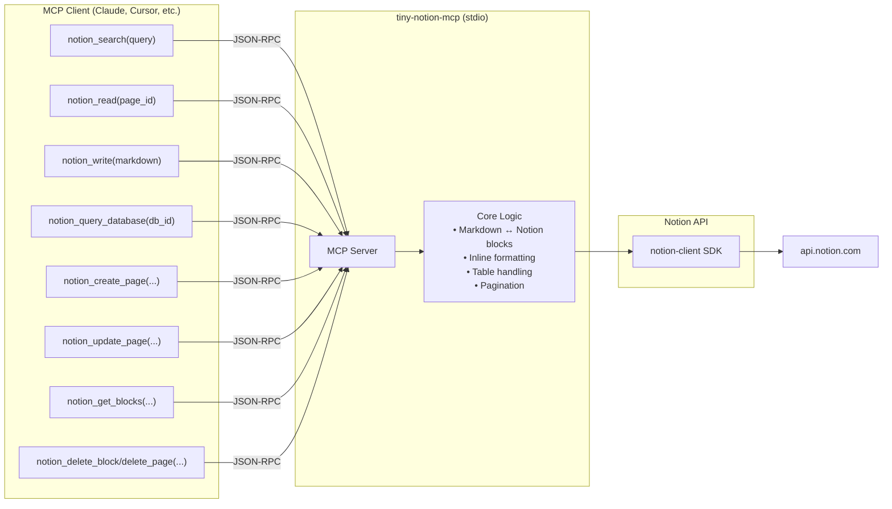

<p align="center">
  <picture>
    <source media="(prefers-color-scheme: dark)" srcset="https://img.shields.io/badge/Notion-000000?style=for-the-badge&logo=notion&logoColor=white">
    
  </picture>
  <h1 align="center">tiny-notion-mcp</h1>
  <p align="center">
    <strong>A token-efficient Notion MCP server that speaks Markdown</strong>
  </p>
  <p align="center">
    <a href="https://www.python.org/downloads/"></a>
    <a href="https://github.com/modelcontextprotocol/servers"></a>
    <a href="LICENSE"></a>
    <a href="https://github.com/anomalyco/tiny-notion-mcp/actions"></a>
  </p>
</p>

---

## Why?

The [official Notion MCP server](https://github.com/makenotion/notion-mcp-server) returns raw Notion API JSON — deeply nested, metadata-heavy payloads that consume thousands of tokens per response. In LLM-powered workflows, token usage directly translates to latency, cost, and context pressure.

**tiny-notion-mcp** takes a different approach: every tool returns the *smallest useful representation*.

| | Official MCP | tiny-notion-mcp |
|---|---|---|
| Read format | Notion API JSON | Plain Markdown |
| Search format | JSON objects | 1 line per result (TOON) |
| Database queries | JSON | Markdown table |
| Inline formatting | Raw annotations | Rendered Markdown |
| Pagination | Manual cursor | `MORE: <cursor>` suffix |

In practice this cuts token consumption by **~60-90%** on read-heavy workflows, while remaining fully compatible with the MCP protocol.

## Architecture



The server uses an abstract `NotionClient` interface, making the core logic fully testable without a Notion account. A production implementation wraps the [`notion-client`](https://pypi.org/project/notion-client/) SDK; tests use a lightweight mock.

## Tools

| Tool | Description |
|---|---|
| `notion_search` | Search pages by title. Returns TOON format — one line per hit. |
| `notion_read` | Read a page as Markdown. Supports pagination via `MORE:` cursors. |
| `notion_get_blocks` | List block IDs and types on a page. Used to find insertion points for `notion_write`. |
| `notion_write` | Append Markdown to a page. Automatically chunked into batches of 50 blocks. |
| `notion_create_page` | Create a sub-page or database entry, optionally with Markdown content. |
| `notion_update_page` | Update Notion properties on a page (status, dates, relations, etc.). |
| `notion_query_database` | Query a database and return results as a Markdown table with an ID column. |
| `notion_delete_block` | ⚠️ Delete a single block (trashed, recoverable for 30 days). |
| `notion_delete_page` | ⚠️ Move a page to Notion trash (recoverable for 30 days). |

### TOON format

Search results and page creation responses use the compact **TOON** format:

```
Page title | page-id | https://notion.so/... | parent:<parent-id>
```

One line per result. No nested JSON. No metadata noise.

## Installation

**Prerequisites:** [uv](https://docs.astral.sh/uv/getting-started/installation/) and a [Notion integration token](https://www.notion.so/profile/integrations).

```sh
git clone https://github.com/AyanoT1/tiny-notion-mcp
cd tiny-notion-mcp
uv tool install .
```

### Connect to your MCP client

**Claude Desktop** (`~/.config/claude/claude_desktop_config.json`):

```json
{
  "mcpServers": {
    "tiny-notion-mcp": {
      "command": "uvx",
      "args": ["tiny-notion-mcp"],
      "env": {
        "NOTION_TOKEN": "ntn_..."
      }
    }
  }
}
```

**Cursor** / **VS Code** with an MCP client:

```json
{
  "mcpServers": {
    "tiny-notion-mcp": {
      "command": "uvx",
      "args": ["tiny-notion-mcp"],
      "env": {
        "NOTION_TOKEN": "ntn_..."
      }
    }
  }
}
```

> **Note:** Before using the tools, connect the integration to any Notion pages or databases you want it to access via the Notion UI (**⋮ → Connections → Add integration**).

## Supported block types

### Read (Notion → Markdown)

| Block type | Markdown output |
|---|---|
| Paragraph | Plain text |
| Heading 1 / 2 / 3 | `#` / `##` / `###` |
| Bulleted list | `- item` |
| Numbered list | `1. item`, `2. item` … |
| Code block | ` ```lang … ``` ` |
| Divider | `---` |
| To-do item | `[ ] text` / `[x] text` |
| Block quote | `> text` |
| Callout | `> [emoji] text` |
| Table | Pipe-delimited rows with Markdown inline formatting |
| Child page | `[Subpage: title](id)` |

All inline formatting (bold, italic, bold-italic, strikethrough, underline, inline code, links) is preserved in Markdown.

### Write (Markdown → Notion)

Markdown is parsed and appended to the target page as native Notion blocks. Large content is automatically split into batches of 50 to respect the Notion API limit. Tables are sent with embedded child rows in a single API call.

> **Tip:** Use `notion_get_blocks` to find a block ID, then pass it as `after_block_id` to `notion_write` to insert content at a specific position rather than the page end.

## Known limitations

- **Toggle blocks, table of contents, files, images, and videos** are silently skipped on read and cannot be written.
- **Empty paragraph blocks are not round-tripped.** Spacer paragraphs in Notion are lost on a read → write cycle. This is inherent to a flat Markdown representation.
- **Table header flag is not round-tripped.** The writer always sets `has_column_header: true` because standard Markdown tables imply a header.

## Design principles

1. **Token efficiency first.** Every response is minimal while remaining actionable.
2. **No intermediate files.** All content is returned inline as strings — no temp files, no file paths.
3. **Testable without a Notion account.** The `NotionClient` interface is injected; core logic is fully isolated.
4. **Native Notion types.** Markdown is converted to real Notion blocks (headings, lists, tables, code blocks, callouts, quotes, to-dos) — not flat text dumps.

## Development

```sh
git clone https://github.com/AyanoT1/tiny-notion-mcp
cd tiny-notion-mcp
uv sync --dev
uv run pytest
```

Tests use a stub `NotionClient` and make no real API calls — no Notion account or token required.

To update a local Claude Code installation after making changes:

```sh
uv tool install . --force --no-cache
```

Then reconnect the MCP server from **Settings → MCP → ⤓ Reconnect**.

## Roadmap

- [ ] Toggle block read/write support
- [ ] Image and file block support
- [ ] Table of contents block support
- [ ] Batch write operations
- [ ] `.env` file support for token configuration
- [ ] PyPI distribution

## License

MIT © [AyanoT1](https://github.com/AyanoT1)
